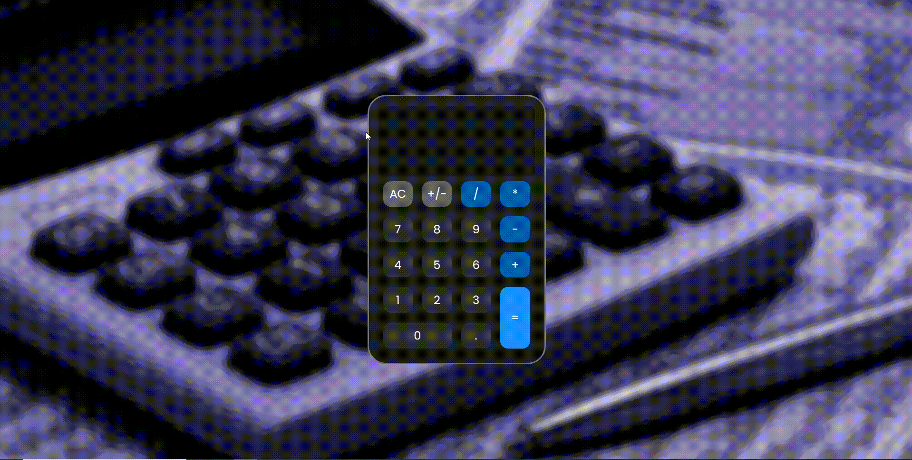

# Projeto - Calculadora
Um projeto desenvolvido por mim que conta a funcionalidade de uma calculadora virtual, similar ao objeto físico que é conhecido, objetivando demonstrar minhas habilidades com a programação e também as possibilidades oferecidas pelas ferramentas utilizadas para a elaboração deste projeto. 🚀❤🙌

[]

## Tecnologias utilizadas 🚀
- HTML5
- CSS3
- JAVASCRIPT
- PHOTOSHOP

## Por que desenvolvi o projeto?
Este trabalho foi desenvolvido com o objetivo de demonstrar a funcionalidade de uma calculadora virtual através da aplicação das tecnologias mais utilizadas no mercado. O projeto demonstra sua funcionalidade simliar à de um objeto físico, realizando operações matemáticas de adição, subtração, multiplicação e divisão. O design foi elaborado por mim mediante a ferramenta do photoshop. Espero que curtem e ajude compartilhando!!!

Feito com ❤ por Flávio Dias Moreira 👏 [Veja meu LinkedIn](https://www.linkedin.com/in/fl%C3%A1vio-dias-moreira-89102a218/)